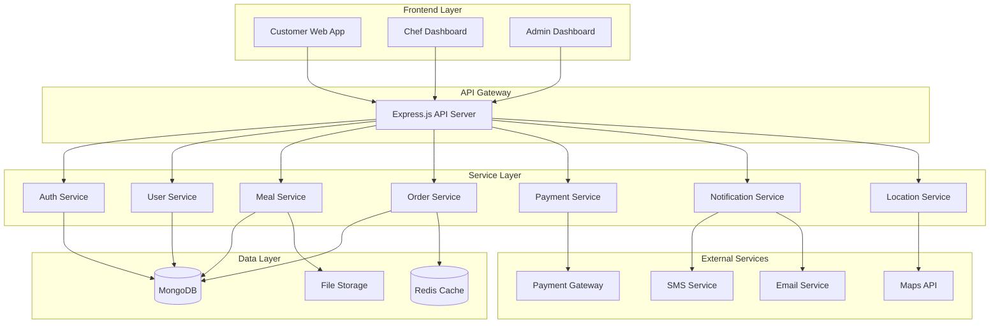

# Design Document

## Overview

The hyperlocal food delivery platform is designed as a full-stack web application with a Node.js/Express backend, React.js frontend, and MongoDB database. The system follows a microservices-inspired modular architecture with clear separation of concerns, RESTful API design, and real-time capabilities for order tracking and notifications.

The platform serves three primary user types: customers, home chefs, and administrators, each with distinct interfaces and capabilities. The system emphasizes location-based services, real-time updates, and scalable architecture to support growth.

## Architecture

### High-Level Architecture



### Technology Stack

**Backend:**
- Node.js with Express.js framework
- MongoDB with Mongoose ODM
- Redis for caching and session management
- Socket.io for real-time communications
- JWT for authentication
- Multer for file uploads
- Bcrypt for password hashing

**Frontend:**
- React.js with functional components and hooks
- React Router for navigation
- Context API for state management
- Axios for API calls
- Socket.io-client for real-time updates
- PWA capabilities with service workers

**External Integrations:**
- Stripe/Razorpay for payment processing
- Google Maps API for location services
- Twilio for SMS notifications
- SendGrid for email services
- Cloudinary for image storage

## Components and Interfaces

### Backend API Structure

```
/api/v1/
├── /auth
│   ├── POST /register
│   ├── POST /login
│   ├── POST /logout
│   ├── POST /refresh-token
│   └── GET /verify-email/:token
├── /users
│   ├── GET /profile
│   ├── PUT /profile
│   ├── PUT /location
│   └── GET /orders
├── /chefs
│   ├── POST /register
│   ├── GET /profile
│   ├── PUT /profile
│   ├── GET /orders
│   └── PUT /status
├── /meals
│   ├── GET /search
│   ├── GET /:id
│   ├── POST / (chef only)
│   ├── PUT /:id (chef only)
│   ├── DELETE /:id (chef only)
│   └── GET /chef/:chefId
├── /cart
│   ├── GET /
│   ├── POST /items
│   ├── PUT /items/:id
│   ├── DELETE /items/:id
│   └── DELETE /clear
├── /orders
│   ├── POST /
│   ├── GET /:id
│   ├── PUT /:id/status
│   ├── GET /tracking/:id
│   └── POST /:id/cancel
├── /payments
│   ├── POST /create-intent
│   ├── POST /confirm
│   └── POST /refund
├── /admin
│   ├── GET /dashboard
│   ├── GET /chefs/pending
│   ├── PUT /chefs/:id/approve
│   ├── GET /orders
│   └── GET /analytics
└── /notifications
    ├── POST /send
    └── GET /preferences
```

### Frontend Component Structure

```
src/
├── components/
│   ├── common/
│   │   ├── Header.jsx
│   │   ├── Footer.jsx
│   │   ├── LoadingSpinner.jsx
│   │   ├── ErrorBoundary.jsx
│   │   └── ProtectedRoute.jsx
│   ├── auth/
│   │   ├── LoginForm.jsx
│   │   ├── RegisterForm.jsx
│   │   └── ChefRegistrationForm.jsx
│   ├── meals/
│   │   ├── MealCard.jsx
│   │   ├── MealList.jsx
│   │   ├── MealDetails.jsx
│   │   ├── MealSearch.jsx
│   │   └── MealForm.jsx (chef)
│   ├── cart/
│   │   ├── CartItem.jsx
│   │   ├── CartSummary.jsx
│   │   └── Checkout.jsx
│   ├── orders/
│   │   ├── OrderCard.jsx
│   │   ├── OrderList.jsx
│   │   ├── OrderTracking.jsx
│   │   └── OrderDetails.jsx
│   ├── chef/
│   │   ├── ChefDashboard.jsx
│   │   ├── MenuManagement.jsx
│   │   ├── OrderManagement.jsx
│   │   └── ChefProfile.jsx
│   └── admin/
│       ├── AdminDashboard.jsx
│       ├── ChefApproval.jsx
│       ├── OrderMonitoring.jsx
│       └── Analytics.jsx
├── pages/
│   ├── HomePage.jsx
│   ├── MealDiscovery.jsx
│   ├── CartPage.jsx
│   ├── OrderHistory.jsx
│   ├── ChefDashboard.jsx
│   └── AdminPanel.jsx
├── contexts/
│   ├── AuthContext.jsx
│   ├── CartContext.jsx
│   └── NotificationContext.jsx
├── services/
│   ├── api.js
│   ├── auth.js
│   ├── location.js
│   └── socket.js
└── utils/
    ├── constants.js
    ├── helpers.js
    └── validation.js
```

## Data Models

### User Schema
```javascript
{
  _id: ObjectId,
  name: String,
  email: String (unique),
  password: String (hashed),
  phone: String,
  role: String (enum: ['customer', 'chef', 'admin']),
  location: {
    type: String (enum: ['Point']),
    coordinates: [Number] // [longitude, latitude]
  },
  address: {
    street: String,
    city: String,
    state: String,
    zipCode: String
  },
  isEmailVerified: Boolean,
  isActive: Boolean,
  preferences: {
    notifications: {
      email: Boolean,
      sms: Boolean,
      push: Boolean
    },
    dietary: [String]
  },
  createdAt: Date,
  updatedAt: Date
}
```

### Chef Schema
```javascript
{
  _id: ObjectId,
  userId: ObjectId (ref: 'User'),
  businessName: String,
  description: String,
  specialties: [String],
  kitchenLicense: String,
  serviceRadius: Number, // in kilometers
  serviceArea: {
    type: String (enum: ['Point']),
    coordinates: [Number]
  },
  rating: {
    average: Number,
    count: Number
  },
  status: String (enum: ['pending', 'approved', 'suspended']),
  availability: {
    isActive: Boolean,
    schedule: [{
      day: String,
      startTime: String,
      endTime: String
    }]
  },
  bankDetails: {
    accountNumber: String,
    routingNumber: String,
    accountHolderName: String
  },
  documents: [{
    type: String,
    url: String,
    uploadedAt: Date
  }],
  createdAt: Date,
  updatedAt: Date
}
```

### Meal Schema
```javascript
{
  _id: ObjectId,
  chefId: ObjectId (ref: 'Chef'),
  name: String,
  description: String,
  price: Number,
  preparationTime: Number, // in minutes
  servingSize: Number,
  cuisine: String,
  dietaryTags: [String], // vegetarian, vegan, gluten-free, etc.
  ingredients: [String],
  images: [String], // URLs
  availability: {
    date: Date,
    startTime: String,
    endTime: String,
    quantity: Number,
    remainingQuantity: Number
  },
  nutritionInfo: {
    calories: Number,
    protein: Number,
    carbs: Number,
    fat: Number
  },
  isActive: Boolean,
  rating: {
    average: Number,
    count: Number
  },
  createdAt: Date,
  updatedAt: Date
}
```

### Order Schema
```javascript
{
  _id: ObjectId,
  customerId: ObjectId (ref: 'User'),
  items: [{
    mealId: ObjectId (ref: 'Meal'),
    chefId: ObjectId (ref: 'Chef'),
    quantity: Number,
    price: Number,
    specialInstructions: String
  }],
  totalAmount: Number,
  deliveryFee: Number,
  tax: Number,
  finalAmount: Number,
  deliveryAddress: {
    street: String,
    city: String,
    state: String,
    zipCode: String,
    coordinates: [Number]
  },
  deliveryType: String (enum: ['delivery', 'pickup']),
  status: String (enum: ['pending', 'confirmed', 'preparing', 'ready', 'out_for_delivery', 'delivered', 'cancelled']),
  paymentStatus: String (enum: ['pending', 'paid', 'failed', 'refunded']),
  paymentIntentId: String,
  estimatedDeliveryTime: Date,
  actualDeliveryTime: Date,
  chefNotes: String,
  customerNotes: String,
  cancellationReason: String,
  tracking: {
    currentLocation: [Number],
    deliveryPartnerId: String,
    estimatedArrival: Date
  },
  createdAt: Date,
  updatedAt: Date
}
```

### Cart Schema
```javascript
{
  _id: ObjectId,
  customerId: ObjectId (ref: 'User'),
  items: [{
    mealId: ObjectId (ref: 'Meal'),
    chefId: ObjectId (ref: 'Chef'),
    quantity: Number,
    price: Number,
    specialInstructions: String,
    addedAt: Date
  }],
  deliveryAddress: {
    street: String,
    city: String,
    state: String,
    zipCode: String,
    coordinates: [Number]
  },
  deliveryType: String (enum: ['delivery', 'pickup']),
  expiresAt: Date,
  createdAt: Date,
  updatedAt: Date
}
```

### Review Schema
```javascript
{
  _id: ObjectId,
  orderId: ObjectId (ref: 'Order'),
  customerId: ObjectId (ref: 'User'),
  chefId: ObjectId (ref: 'Chef'),
  mealId: ObjectId (ref: 'Meal'),
  rating: Number (1-5),
  comment: String,
  images: [String],
  isVerified: Boolean,
  createdAt: Date,
  updatedAt: Date
}
```

## Error Handling

### API Error Response Format
```javascript
{
  success: false,
  error: {
    code: String, // ERROR_CODE
    message: String, // Human readable message
    details: Object, // Additional error details
    timestamp: Date
  }
}
```

### Error Categories

**Authentication Errors (401)**
- INVALID_CREDENTIALS
- TOKEN_EXPIRED
- TOKEN_INVALID
- EMAIL_NOT_VERIFIED

**Authorization Errors (403)**
- INSUFFICIENT_PERMISSIONS
- ACCOUNT_SUSPENDED
- CHEF_NOT_APPROVED

**Validation Errors (400)**
- INVALID_INPUT
- MISSING_REQUIRED_FIELDS
- INVALID_EMAIL_FORMAT
- WEAK_PASSWORD

**Business Logic Errors (422)**
- MEAL_NOT_AVAILABLE
- INSUFFICIENT_QUANTITY
- ORDER_ALREADY_CONFIRMED
- PAYMENT_FAILED

**System Errors (500)**
- DATABASE_ERROR
- EXTERNAL_SERVICE_ERROR
- FILE_UPLOAD_ERROR

### Frontend Error Handling Strategy

1. **Global Error Boundary**: Catch and display unexpected React errors
2. **API Error Interceptor**: Handle common API errors (401, 403, 500)
3. **Form Validation**: Client-side validation with real-time feedback
4. **Retry Mechanisms**: Automatic retry for network failures
5. **User-Friendly Messages**: Convert technical errors to user-friendly messages

## Testing Strategy

### Backend Testing

**Unit Tests**
- Service layer functions
- Utility functions
- Data validation
- Authentication middleware

**Integration Tests**
- API endpoints
- Database operations
- External service integrations
- Payment processing

**End-to-End Tests**
- Complete user workflows
- Order placement and tracking
- Chef menu management
- Admin operations

### Frontend Testing

**Component Tests**
- Individual component rendering
- User interactions
- Props handling
- State management

**Integration Tests**
- API integration
- Context providers
- Route navigation
- Form submissions

**E2E Tests**
- Complete user journeys
- Cross-browser compatibility
- Mobile responsiveness
- PWA functionality

### Testing Tools

**Backend:**
- Jest for unit and integration tests
- Supertest for API testing
- MongoDB Memory Server for test database
- Sinon for mocking external services

**Frontend:**
- Jest and React Testing Library
- Cypress for E2E testing
- MSW (Mock Service Worker) for API mocking
- Lighthouse for performance testing

### Performance Considerations

**Database Optimization**
- Geospatial indexing for location queries
- Compound indexes for common query patterns
- Connection pooling
- Query optimization and monitoring

**Caching Strategy**
- Redis for session storage
- API response caching
- Static asset caching
- Database query result caching

**Frontend Optimization**
- Code splitting and lazy loading
- Image optimization and lazy loading
- Service worker for offline functionality
- Bundle size optimization

**Scalability Considerations**
- Horizontal scaling with load balancers
- Database sharding strategies
- CDN for static assets
- Microservices architecture preparation

### Security Measures

**Authentication & Authorization**
- JWT tokens with refresh mechanism
- Role-based access control
- Password hashing with bcrypt
- Email verification

**Data Protection**
- Input validation and sanitization
- SQL injection prevention
- XSS protection
- CORS configuration
- Rate limiting

**Payment Security**
- PCI DSS compliance
- Secure payment processing
- Encrypted sensitive data
- Audit trails for transactions

**Infrastructure Security**
- HTTPS enforcement
- Environment variable management
- Database access controls
- API key management+